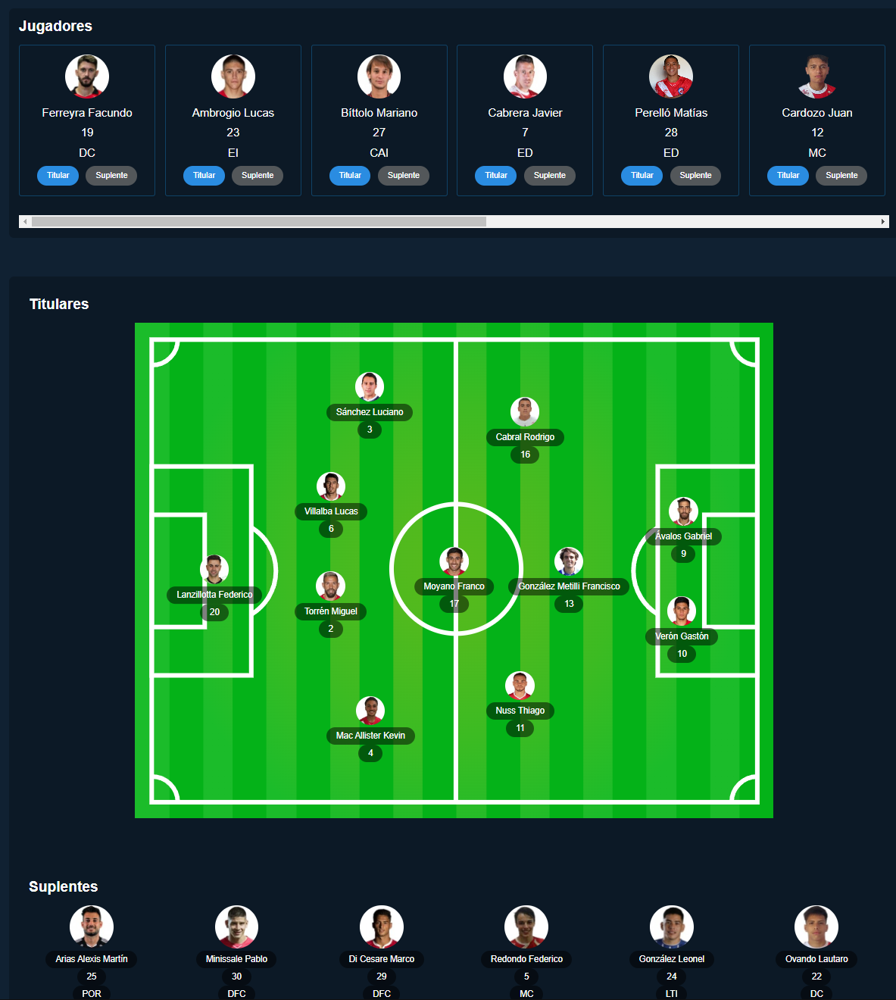

# Proyecto de una pizarra de futbol para DT
proyecto en desarrollo...

Actualmente cuenta con una pizarra para insertar jugadores titulares y suplentes en un campo de futbol.

Unicamente front-end con React y Sass

Proximas actualizaciones:
Base de datos y creador de jugadores
Posibilidad de cambiar la formacion mediante botones
Diferenciacion entre posiciones y jugadores.

